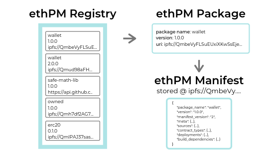

# Introduction

ethPM is the immutable package manager to consume, distribute, or manage any EVM smart contract system. 

An ethPM package represents the _**idea**_ of a smart contract; from a single smart contract file, to a deployed contract instance, to a complex system of smart contracts, and everything in between.

At its core, an ethPM package is a JSON object containing the ABI, source code, bytecode, deployment data and any other information that combines together to compose the smart contract idea. The [ethPM specification](http://ethpm.github.io/ethpm-spec/) defines a schema to store all of this data in a structured JSON format, enabling quick and efficient transportation of smart contract ideas between tools and frameworks which support the specification.

ethPM has similar goals to most package managers found in any given programming language. 

1. Easily import and build upon core ideas written by others.
2. Distribute the ideas that you've written and/or deployed, making them easily consumable for tooling and the community at large.

## ethPM  Architecture



#### ethPM Registry

A registry is an on-chain datastore containing the data for released ethPM packages. Unlike traditional package managers which maintain a single, centralized package registry \(eg. NPM, pypi\) ethPM uses a federated model where everybody is required to deploy and maintain their own, permissioned package registry \(or registries\). 

In a world of trustless computation, trust is critical when it comes to consuming smart contract packages. A single line of malicious code in a `wallet` package could be the difference between a successful dapp or a successful hack. That is why you should _**NEVER**_ import a package from a registry with an unknown or untrusted owner. 

That last sentence is important, it's worth repeating.

`ONLY USE PACKAGES FROM TRUSTED REGISTRIES!`

#### ethPM Package

An ethPM package is a combination of 3 elements that represent an immutable smart contract idea. 

* Package name
* Package version
* [Content-Addressed URI](uris.md#content-addressed-uris)

These three elements are stored on-chain in an ethPM registry. [ERC1319](http://eips.ethereum.org/EIPS/eip-1319), which defines the registry API, enforces that once a package is released, it can never be re-released. The immutability of the blockchain and content-addressed URIs provide absolute certainty that once you interact with a `<wallet==1.2.0>` package from a certain registry, there is 100% certainty that it can never be modified.

#### ethPM Manifest

A manifest is the actual JSON file that contains the JSON object which defines an ethPM package. The JSON file is stored at the content-addressed URI defined in each package release. 

The bare minimum ethPM manifest defines three fields. 

```bash
{
    "name": "myPackage",
    "version": "1.0.0",
    "manifest": "ethpm/3"
}
```

Of course, this manifest does not represent a very useful package, so it is up to the creator of each manifest to include whatever `contractTypes`, `sources`, `deployments`, `compilers`, `meta` \(data\) or `buildDependencies` that are necessary to compose the desired smart contract idea.

Manifests may live on disk, but are intended to be produced and consumed programmatically and uploaded directly to a content-addressable storage network \(e.g. [IPFS](https://ipfs.io/)\).

#### ethPM's history

ethPM started out as the brainchild of Tim Coulter and Piper Merriam. Since its inception, it has undergone a breaking update from v1 to v2 in 2018, and another breaking update from v2 to v3 in 2020. The goals of these updates were to improve the specification to facilitate better cross-compatibility and advanced use-cases for ethPM packages. Currently, v3 tooling and support across libraries is still under development. If you would like to help contribute to and develop the ethPM ecosystem, [read here](ethpm-developer-guide/ethpm-questions-and-support.md#whats-the-best-way-to-contribute).

